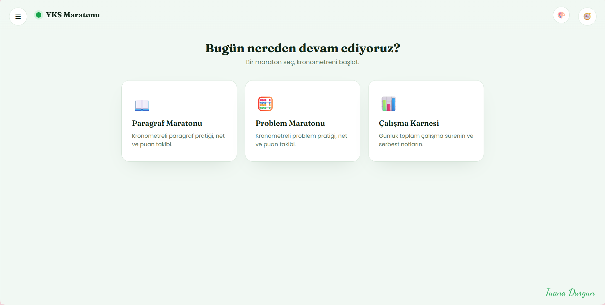
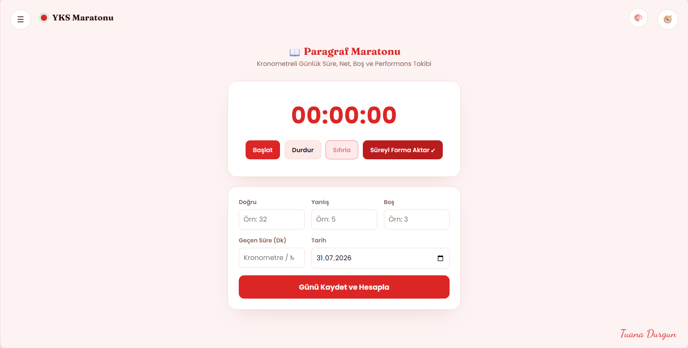
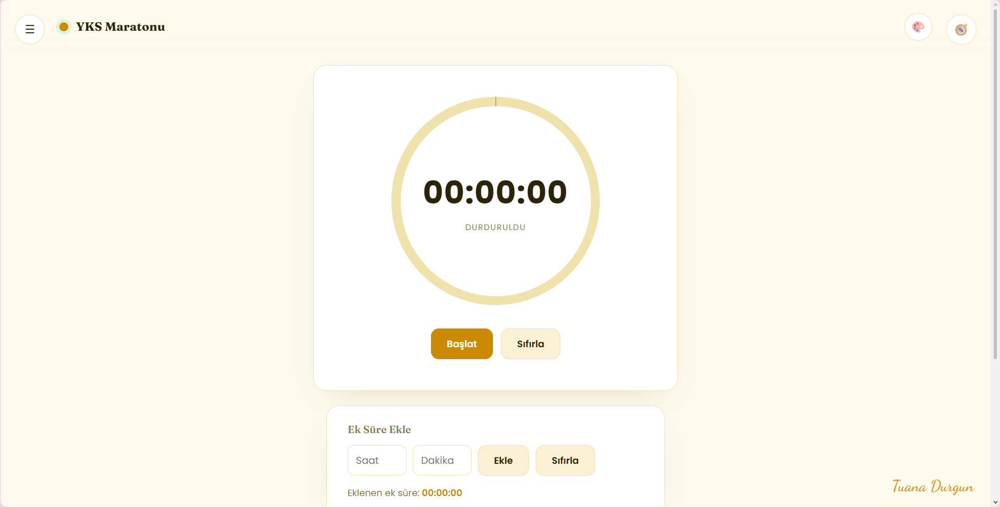
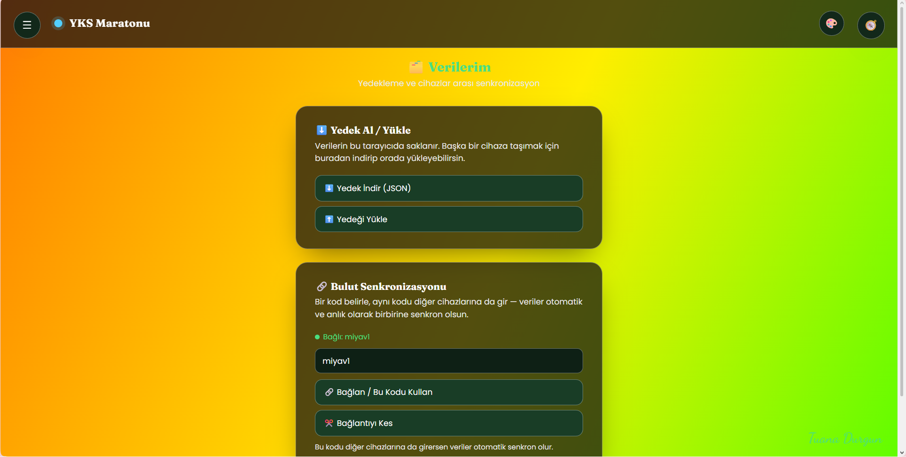

<div align="center">

# 🎓 YKS Maratonu

**Paragraf, Problem ve Çalışma Karnesini tek çatı altında toplayan, kişisel YKS takip platformu.**

[](https://yksmaratonu.netlify.app)


-fb7185?style=flat-square)


**[🌐 Canlı Siteyi Aç](https://yksmaratonu.netlify.app)**

</div>

---

## 📖 İçindekiler

- [Nedir bu?](#-nedir-bu)
- [Ekran Görüntüleri](#-ekran-görüntüleri)
- [Özellikler](#-özellikler)
  - [📖 Paragraf Maratonu & 🧮 Problem Maratonu](#-paragraf-maratonu--problem-maratonu)
  - [📊 Çalışma Karnesi](#-çalışma-karnesi)
  - [🔗 Modüller Arası Bağlantı](#-modüller-arası-bağlantı)
  - [🎨 Tema Sistemi](#-tema-sistemi)
  - [🗂️ Verilerim (Yedekleme & Senkronizasyon)](#️-verilerim-yedekleme--senkronizasyon)
- [Puanlama Formülü](#-puanlama-formülü)
- [Ekran Yapısı](#️-ekran-yapısı)
- [Teknik Detaylar](#-teknik-detaylar)
- [Kurulum / Kendi Kopyanı Çalıştırma](#-kurulum--kendi-kopyanı-çalıştırma)
- [Bulut Senkronizasyonu Kurulumu](#️-bulut-senkronizasyonu-kurulumu)
- [Veri Gizliliği](#-veri-gizliliği)
- [Yol Haritası](#-yol-haritası)
- [Katkıda Bulunma](#-katkıda-bulunma)
- [Lisans](#-lisans)
- [Kredi](#-kredi)

---

## 🧠 Nedir bu?

**YKS Maratonu**, YKS'ye hazırlanırken paragraf ve problem sorularını kronometre eşliğinde çözmeyi, performansını puanlamayı ve günlük toplam çalışma sürenini tek bir yerden takip etmeyi sağlayan, tamamen ücretsiz ve reklamsız bir web uygulamasıdır.

Üç modül tek bir çatı altında birleşir ve **birbirini besler**: bir gün çözdüğün paragraf ve problem sorularının süresi, otomatik olarak o günün toplam çalışma karnesine yansır.

> Kurulum gerektirmez, hesap açmaya gerek yoktur. Tarayıcında aç, kullanmaya başla.

---

## 📸 Ekran Görüntüleri

> Aşağıdaki görseller `/screenshots` klasöründen okunur. Kendi ekran görüntülerini aynı isimlerle bu klasöre eklemen yeterli — otomatik olarak burada görünecekler.

<div align="center">

| Ana Sayfa | Paragraf / Problem Maratonu |
|---|---|
|  |  |

| Çalışma Karnesi | Tema Seçimi |
|---|---|
|  |  |

</div>

**Görsel eklemek için:**
1. Proje klasöründe bir `screenshots/` klasörü oluştur.
2. Siteden aldığın ekran görüntülerini şu isimlerle içine koy: `ana-sayfa.png`, `maraton.png`, `karnesi.png`, `temalar.png`.
3. Bu dosya (README.md) otomatik olarak bu görselleri gösterecektir — başka bir şey yapmana gerek yok.

---

## ✨ Özellikler

### 📖 Paragraf Maratonu & 🧮 Problem Maratonu

İki modül aynı mantıkla çalışır, sadece adları ve kayıtları ayrıdır:

- ⏱️ **Büyük, net kronometre** — başlat / durdur / sıfırla
- ↙️ **"Süreyi Forma Aktar"** — kronometrede geçen süreyi otomatik olarak forma dakika cinsinden yazar
- ✅ **Doğru / Yanlış / Boş** girişi — **soru sayısı sınırı yok**, istediğin kadar soru gir
- 📈 **Otomatik net ve puan hesaplama** (bkz. [Puanlama Formülü](#-puanlama-formülü))
- 🗓️ **Bir tarihe bir kayıt** — aynı günü yanlışlıkla iki kez kaydetmeni engeller
- 📋 Kayıtların kenar çubuğunda kronolojik listelenir; üzerine tıklayınca detaylı istatistik kartı açılır

### 📊 Çalışma Karnesi

- ⏱️ Büyük, dairesel kronometre — çalışırken görsel olarak "nabız atar"
- ➕ **Ek süre ekleme** — kronometre dışında geçirdiğin süreyi elle ekleyebilirsin
- 💾 **"Günü Kaydet"** — kronometre + ek süre toplanıp o güne kaydedilir (günde bir kez)
- 📝 Her günün üzerine tıklayınca açılan **not defteri** — o gün ne çalıştığını serbestçe yazabilirsin, otomatik kaydedilir
- 📅 Kenar çubuğunda tüm günlerin **toplam süresi** listelenir

### 🔗 Modüller Arası Bağlantı

Bu, uygulamanın en can alıcı özelliği:

```
Paragraf Maratonu'nda kaydettiğin süre  ─┐
Problem Maratonu'nda kaydettiğin süre   ─┼─▶  Çalışma Karnesi'ndeki günün TOPLAM süresi
Karnesi'nde manuel kaydettiğin süre     ─┘
```

- Paragraf veya problemde bir günü **kaydettiğin an**, o sürenin dakikası otomatik olarak Çalışma Karnesi'ndeki o günün toplamına eklenir.
- Paragraf/problem tarafında bir kaydı **sildiğinde**, o süre toplam süreden anında düşer.
- Böylece Çalışma Karnesi, gerçek anlamda **günün bütün emeğinin** tek bir toplamını gösterir — üç ayrı yerde ayrı ayrı takip etmene gerek kalmaz.

### 🎨 Tema Sistemi

- 🟢 Yeşil (varsayılan), 🔴 Kırmızı, 🟡 Sarı, ⚪ Beyaz, ⚫ Siyah ve 🌈 **Rengarenk** (gerçek anlamda hareketli, gökkuşağı temalı) tema seçenekleri
- Sağ üstteki 🎨 ikonuna tıklayınca açılan gizli bir panelden seçiliyor — arayüz sade kalıyor
- **Yeşil / Kırmızı / Sarı** temalar, **tarayıcının açık/koyu mod tercihine otomatik uyum sağlar** — cihazın koyu moddaysa koyu ton, açık moddaysa açık ton otomatik devreye girer

### 🗂️ Verilerim (Yedekleme & Senkronizasyon)

- **⬇️ Yedek İndir / ⬆️ Yedeği Yükle** — tüm verilerini tek bir JSON dosyası olarak indirip başka bir cihaza taşıyabilirsin
- **🔗 Bulut Senkronizasyonu** — Firebase üzerinden, belirlediğin bir kodu tüm cihazlarına girerek verilerinin **anlık ve otomatik** olarak senkronize olmasını sağlayabilirsin (telefon ↔ bilgisayar ↔ başka bir tarayıcı fark etmez)

---

## 🧮 Puanlama Formülü

Paragraf ve Problem Maratonu'ndaki puan, **10 üzerinden**, ondalıklı olarak (örn. `8,1 / 10`) şu mantıkla hesaplanır:

| Adım | Formül |
|---|---|
| **Net** | `Doğru − (Yanlış × 0,25)` |
| **Soru Başı Süre** | `Toplam Süre (dk) ÷ Toplam Soru Sayısı` |
| **Puan** | `(Net ÷ Soru Başı Süre) × 0,5` → `0`–`10` arasına sabitlenir |

**Mantık:** Aynı hızda (soru başı süre) çözülen sorularda net arttıkça puan artar. Aynı net sayısında, soru başına düşen süre azaldıkça (yani daha hızlı ve isabetli çözüldükçe) puan artar. Böylece hem **doğruluk** hem **hız** birlikte ödüllendirilir.

---

## 🗺️ Ekran Yapısı

```
┌─────────────────────────────────────────────────┐
│  ☰ (kayıtlar)     YKS Maratonu        🎨  🧭 (sayfalar) │
├─────────────────────────────────────────────────┤
│                                                   │
│     🏠 Ana Sayfa → 3 büyük kart:                 │
│     📖 Paragraf Maratonu                         │
│     🧮 Problem Maratonu                          │
│     📊 Çalışma Karnesi                           │
│                                                   │
│     (Her sayfa yeni sekme açmadan, aynı          │
│      pencere içinde anında değişir)              │
│                                                   │
└─────────────────────────────────────────────────┘
     Sol kenar çubuğu: o sayfaya ait kayıtlar
     Sağ kenar çubuğu: sayfalar arası hızlı geçiş
```

- **Sol kenar çubuğu (☰):** Bulunduğun sayfanın kayıtlarını listeler (günler / paragraf kayıtları / problem kayıtları). Üstteki **"+ Yeni Ekle"** butonuyla veya bir kayda **sağ tıklayarak** düzenleme/silme yapabilirsin.
- **Sağ kenar çubuğu (🧭):** Ana Sayfa, Paragraf, Problem, Çalışma Karnesi ve Verilerim sayfaları arasında sayfa yenilemeden geçiş sağlar.
- İki kenar çubuğu **aynı anda açık olamaz** — biri açıldığında diğeri otomatik kapanır, mobilde çakışma yaşanmaz.
- Sağ alt köşede imza: *Tuana Durgun* ✒️

---

## 🛠️ Teknik Detaylar

| Katman | Kullanılan Teknoloji |
|---|---|
| Arayüz | Saf **HTML + CSS + Vanilla JavaScript** (framework yok, tek dosya) |
| Yazı Tipleri | [Fraunces](https://fonts.google.com/specimen/Fraunces) (başlıklar), [Poppins](https://fonts.google.com/specimen/Poppins) (gövde), [Dancing Script](https://fonts.google.com/specimen/Dancing+Script) (imza) |
| Yerel Depolama | Tarayıcı `localStorage` |
| Bulut Senkronizasyonu | [Firebase Firestore](https://firebase.google.com/products/firestore) (ücretsiz Spark planı) |
| Barındırma | [Netlify](https://yksmaratonu.netlify.app) |

**Öne çıkan mimari tercihler:**
- Tek bir `.html` dosyası — sunucu, derleme adımı veya paket yöneticisi gerektirmez.
- Paragraf ve Problem Maratonu, aynı arayüz bileşenlerini (kronometre, form, kayıt listesi) paylaşır; sadece etiketler ve veri anahtarları farklıdır — kod tekrarını önler.
- Tüm günlük toplamlar **anlık hesaplanır** (canlı toplama), yani üç modül arasında veri tutarsızlığı yaşanmaz.

---

## 🚀 Kurulum / Kendi Kopyanı Çalıştırma

Bu proje tek bir HTML dosyasından oluştuğu için kurulum yok denecek kadar basit:

1. `yks-maratonu.html` dosyasını indir.
2. Çift tıklayarak tarayıcında aç **ya da** VS Code üzerinden "Live Server" eklentisiyle çalıştır.
3. Hepsi bu — veriler otomatik olarak tarayıcının `localStorage`'ında saklanır.

**Kendi alan adına / Netlify'a yayınlamak istersen:**

```bash
# Netlify CLI ile (opsiyonel)
netlify deploy --prod
```

ya da dosyayı doğrudan [Netlify Drop](https://app.netlify.com/drop) sayfasına sürükleyip bırakman yeterli.

---

## ☁️ Bulut Senkronizasyonu Kurulumu

Verilerinin cihazlar arasında otomatik senkron olmasını istiyorsan (opsiyonel):

1. [console.firebase.google.com](https://console.firebase.google.com) → **ücretsiz** bir proje oluştur.
2. **Build → Firestore Database** → *Create database* → test modunda başlat.
3. **Project Settings → Your apps → Web (`</>`)** → uygulamanı kaydet, sana verilen `firebaseConfig` bilgilerini kopyala.
4. HTML dosyasındaki `firebaseConfig` nesnesine bu bilgileri yapıştır.
5. Siteyi aç → **Verilerim** sayfasından bir senkron kodu belirle (örn. `tuana2026`) → aynı kodu diğer cihazlarına da gir.

> 30 günlük test modu süresi dolmadan Firestore kurallarını sıkılaştırman önerilir (kod, README'nin altında değil, proje sohbetinde ayrıca paylaşılmıştır).

---

## 🔒 Veri Gizliliği

- Hiçbir veri, kullanıcı hesabı veya kişisel bilgi olmadan çalışır.
- Varsayılan olarak tüm veriler **sadece kendi tarayıcında** saklanır.
- Bulut senkronizasyonu tamamen opsiyoneldir ve yalnızca senin belirlediğin bir "kod" ile eşleşen cihazlar arasında çalışır.
- Reklam, takip kodu veya üçüncü taraf analiz aracı bulunmaz.

---

## 🧭 Yol Haritası

- [ ] Firestore güvenlik kurallarını sıkılaştırma (gerçek kimlik doğrulama)
- [ ] Haftalık / aylık istatistik grafikleri
- [ ] TYT & AYT branş bazlı ayrı takip
---

## 🤝 Katkıda Bulunma

Bu proje kişisel bir ihtiyaçtan doğdu, ama iyileştirme önerilerine açık:

1. Depoyu **fork'la**.
2. Yeni bir dal oluştur: `git checkout -b ozellik/yeni-ozellik`
3. Değişikliklerini yap ve anlamlı bir commit mesajıyla kaydet: `git commit -m "Yeni özellik: ..."`
4. Dalını gönder: `git push origin ozellik/yeni-ozellik`
5. Bir **Pull Request** aç ve neyi neden değiştirdiğini kısaca anlat.

**Hata bildirimi / öneri** için bir *Issue* açman yeterli — ekran görüntüsü veya tarayıcı konsolundaki hata mesajını eklemen çözümü hızlandırır.

Proje tek bir `.html` dosyası olduğu için katkı süreci oldukça basittir: build adımı, bağımlılık kurulumu ya da derleme yoktur — dosyayı düzenle, tarayıcıda aç, test et.

---

## 📜 Lisans

Bu proje [MIT Lisansı](LICENSE) ile paylaşılmıştır — kodu özgürce kopyalayabilir, değiştirebilir ve kendi ihtiyaçların için kullanabilirsin. Ticari ya da kişisel her türlü kullanımda tek beklenti, orijinal lisans metnini korumandır.

> Not: "Tuana Durgun" imzası ve "YKS Maratonu" ismi bu projenin kişisel bir anısıdır; kodu kullanırken imzayı kendi adınla değiştirmen tamamen normaldir 🙂

---

## 💌 Kredi

**Tasarım & geliştirme:** Claude (Anthropic) ile birlikte, adım adım
**Site:** [yksmaratonu.netlify.app](https://yksmaratonu.netlify.app)

<div align="center">

*Tuana Durgun* ✒️

</div>
